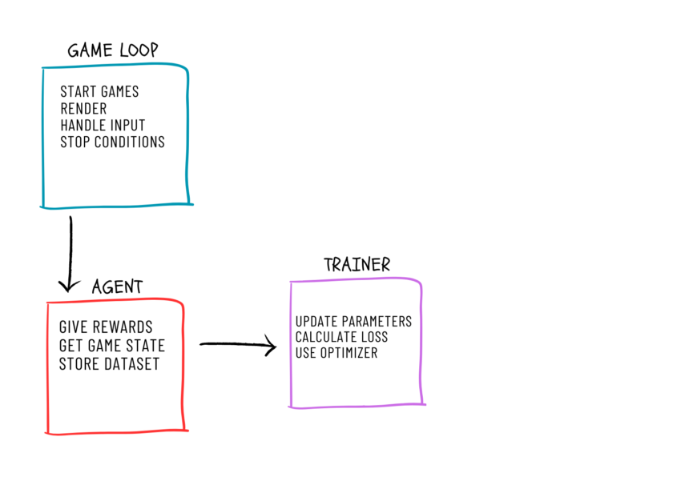

# Projet d'IA - Q-Learning Snake

## Description du Projet

Ce projet implémente une intelligence artificielle pour jouer au jeu Snake en utilisant l'algorithme de Q-learning. Le but est de développer un agent capable d'apprendre à jouer de manière optimale en maximisant les récompenses obtenues au fil des épisodes.

## Structure du Projet

Le projet est structuré autour de plusieurs fichiers clés, notamment :

- `main.py`
- `agent.py`

### `main.py`

Le fichier `main.py` contient la boucle principale du programme. Cette boucle exécute un nombre défini d'épisodes, au cours desquels l'agent joue au jeu Snake, apprend et améliore sa stratégie. Voici un aperçu des fonctionnalités de `main.py` :

- Initialisation de l'environnement du jeu Snake.
- Boucle principale pour gérer le nombre d'épisodes.
- Appels à l'agent pour décider des actions à entreprendre.
- Mise à jour de l'environnement et gestion des récompenses.
- Sauvegarde de la Q-table à la fin de l'exécution.

Si `main.py` s'exécute jusqu'au bout, alors la Q-table est enregistrée localement. Pour charger la Q-table précédente au démarrage, l'utilisateur doit laisser certaines lignes de code non commentées dans `main.py`. Sinon, il peut commenter ces lignes s'il souhaite que l'IA apprenne de zéro.

### `agent.py`

Le fichier `agent.py` contient la définition de l'agent utilisant l'algorithme de Q-learning. Les principales responsabilités de cet agent sont :

- Récupérer les états du jeu.
- Choisir les actions en fonction de l'état actuel du jeu.
- Mettre à jour la table Q en utilisant les récompenses obtenues.
- Équilibrer l'exploration et l'exploitation pour améliorer la stratégie de jeu.

Les paramètres de l'agent peuvent être modifiés pour ajuster le comportement du modèle d'apprentissage, tels que le taux d'apprentissage (alpha), le facteur de discount (gamma) et le taux d'exploration (epsilon).

## Schéma de l'Architecture

Voici un schéma illustrant l'architecture du projet :



## Détails de l'Algorithme de Q-Learning

L'algorithme de Q-learning est un algorithme d'apprentissage par renforcement qui apprend une fonction de valeur d'action, Q(s, a), représentant la qualité de l'action `a` dans l'état `s`. L'agent utilise cette fonction pour choisir les actions qui maximisent la récompense cumulée attendue.

### Fonctionnement de base :

1. **Initialisation** : Initialiser la table Q avec des valeurs arbitraires.
2. **Choix de l'action** : Choisir une action en utilisant une politique d'exploration/exploitation (par exemple, epsilon-greedy).
3. **Mise à jour** : Après avoir observé le résultat de l'action, mettre à jour la valeur Q en fonction de la récompense obtenue et de la valeur Q future estimée.

La formule de mise à jour est la suivante :
\[ Q(s, a) \leftarrow Q(s, a) + \alpha \left( r + \gamma \max_{a'} Q(s', a') - Q(s, a) \right) \]
où :
- \( \alpha \) est le taux d'apprentissage,
- \( \gamma \) est le facteur de discount,
- \( r \) est la récompense obtenue après avoir pris l'action \( a \) dans l'état \( s \),
- \( s' \) est le nouvel état après avoir pris l'action \( a \),
- \( \max_{a'} Q(s', a') \) est la valeur estimée optimale de la prochaine action.

## Installation et Exécution

### Prérequis

- Python 3.x
- Bibliothèques nécessaires : numpy, pygame, pickle, matplotlib

### Installation

1. Cloner le dépôt du projet :

2. Installer les dépendances mentionnée ci-dessus

### Exécution

Pour lancer l'entrainement de l'agent, exécutez :
```sh
python main.py

